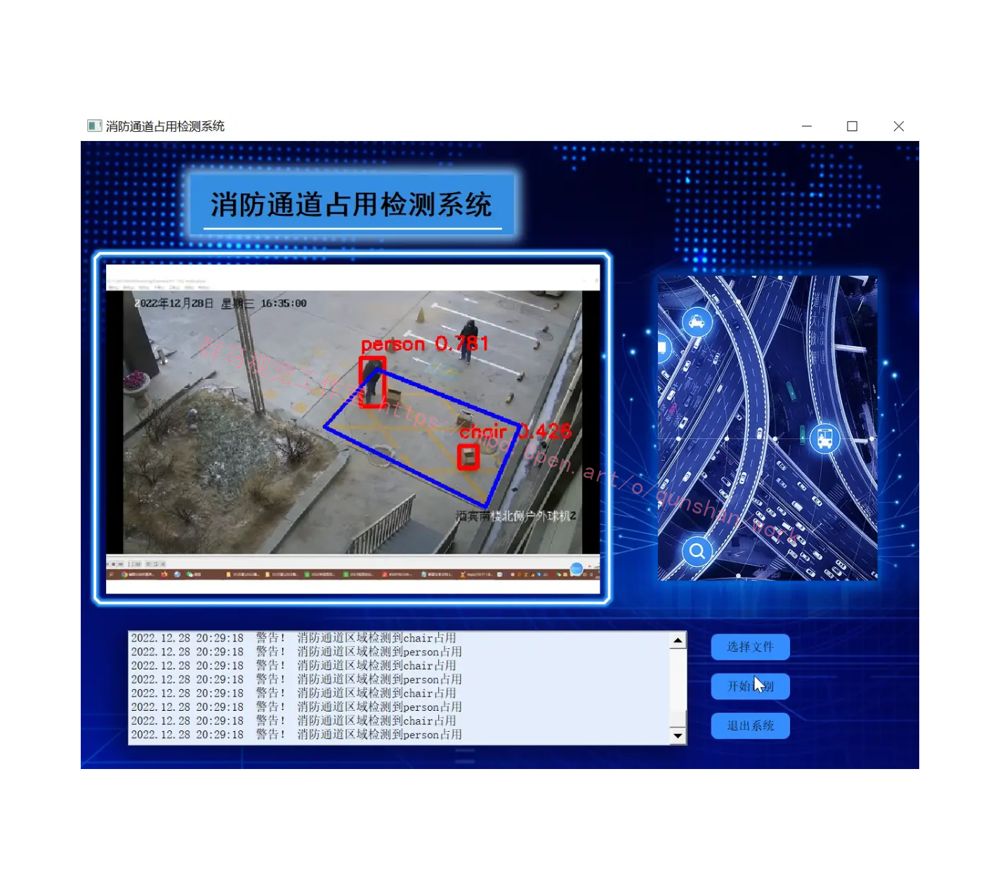
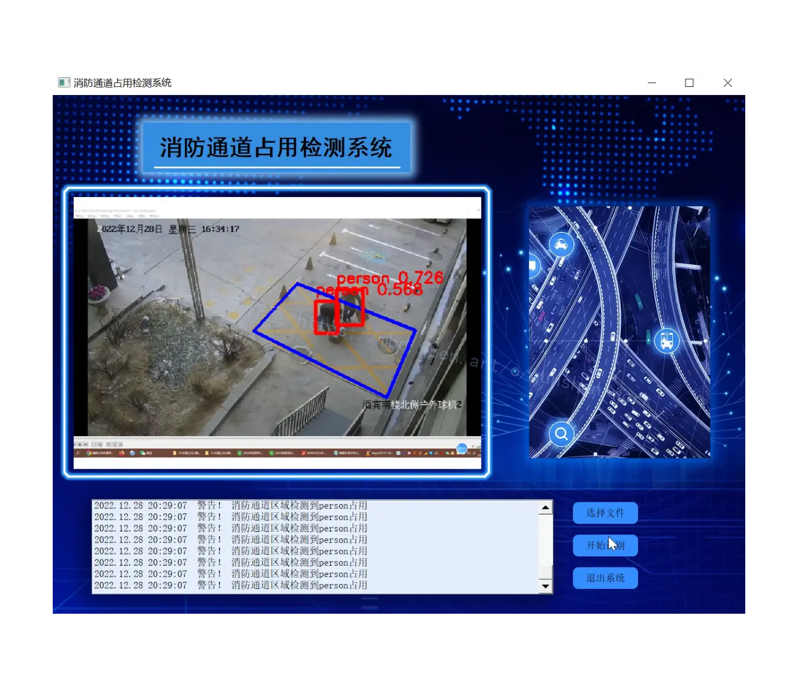
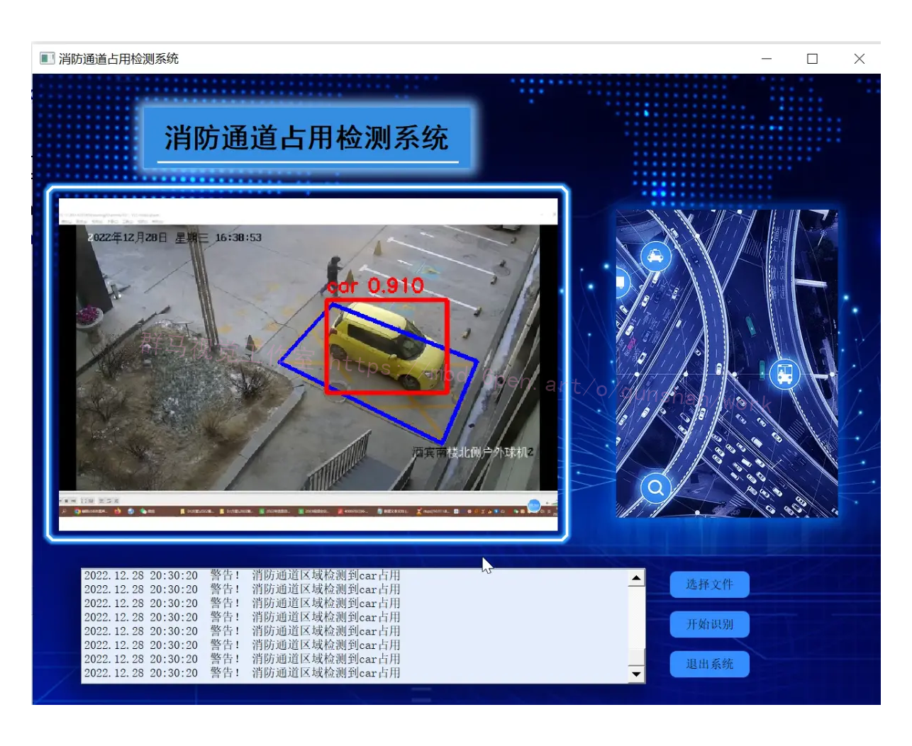
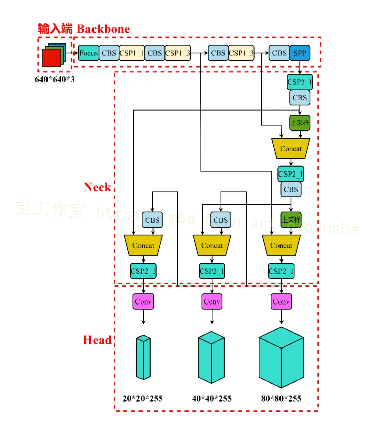
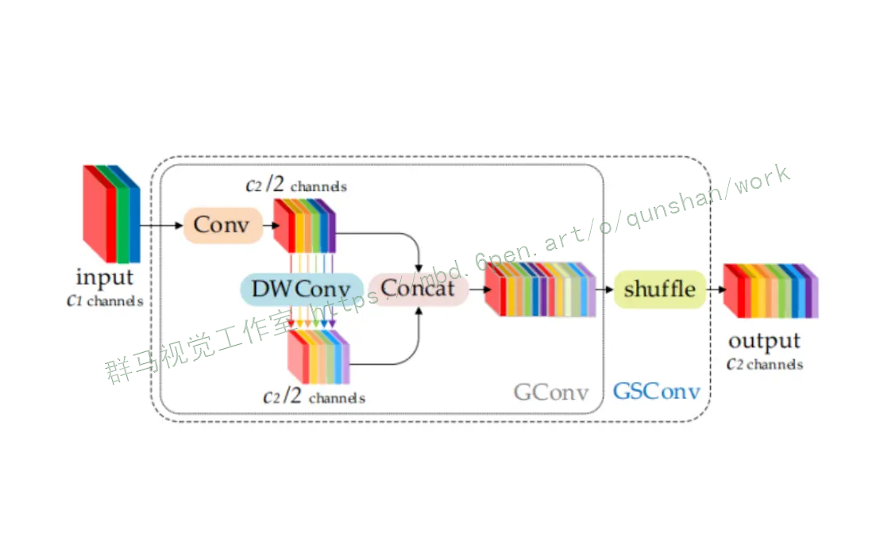
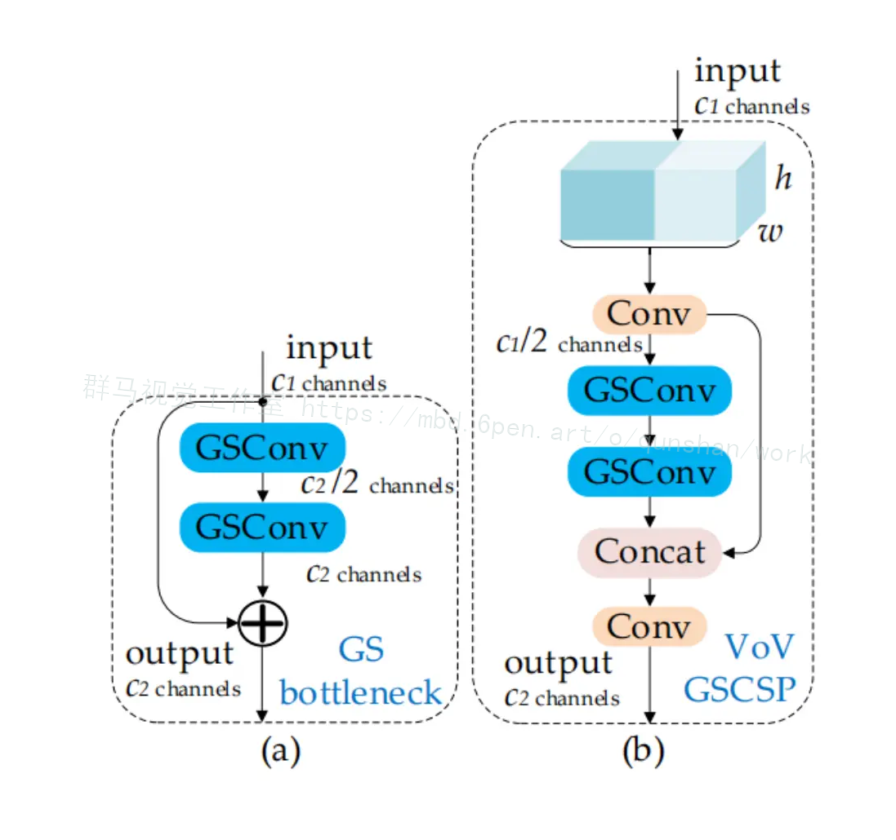
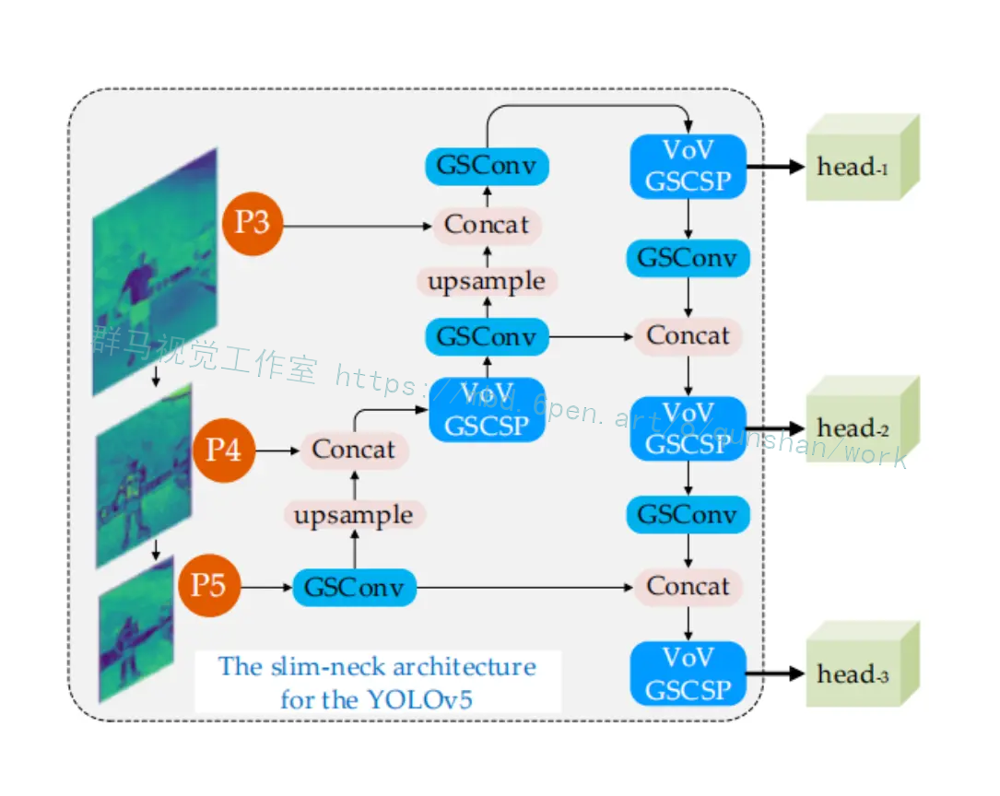
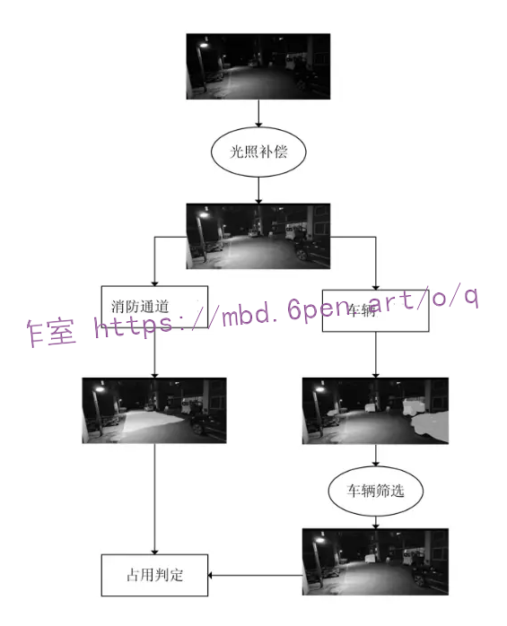
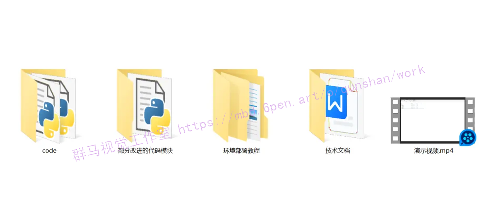



## 1.研究背景与意义


消防通道的畅通对于人员的生命安全和财产安全至关重要。然而，在现实生活中，由于各种原因，消防通道常常被非法占用，导致消防车辆无法及时到达火灾现场，严重威胁了人们的生命财产安全。因此，开发一种高效准确的消防通道占用检测系统具有重要的现实意义。

目前，计算机视觉技术在目标检测领域取得了显著的进展。YOLOv5是一种基于深度学习的目标检测算法，具有快速、准确的特点。然而，传统的YOLOv5在消防通道占用检测中存在一些问题，如对小目标的检测效果不佳、容易受到背景干扰等。因此，对YOLOv5进行改进，提高其在消防通道占用检测中的性能，具有重要的研究意义。

在研究背景的基础上，本研究提出了一种基于GSConv+SlimNeck的YOLOv5的消防通道占用检测系统。该系统主要包括两个关键技术：GSConv和SlimNeck。

首先，GSConv是一种改进的卷积操作，通过引入组稀疏卷积和组稠密卷积的思想，有效提高了目标检测的性能。传统的卷积操作在处理大尺度目标时容易丢失细节信息，而GSConv能够更好地保留目标的细节信息，提高目标检测的准确性。

其次，SlimNeck是一种轻量级的特征融合模块，通过减少特征通道的数量，降低了模型的复杂度，提高了模型的运行速度。在消防通道占用检测中，由于目标通常较小，特征通道的数量过多会导致模型的冗余，影响检测的效果。SlimNeck能够有效减少特征通道的数量，提高模型的检测速度和准确性。


## 2.图片演示







# 3.演示视频
[基于GSConv+SlimNeck的YOLOv5的消防通道占用检测系统_哔哩哔哩_bilibili](https://www.bilibili.com/video/BV1pu4y1E7r2/?spm_id_from=333.999.0.0&vd_source=ff015de2d29cbe2a9cdbfa7064407a08)


# 4.系统优点

首先，该系统能够提高目标检测的准确性。通过引入GSConv操作，能够更好地保留目标的细节信息，提高目标检测的准确性，减少误检率和漏检率。

其次，该系统具有较高的运行速度。通过引入SlimNeck模块，能够减少特征通道的数量，降低模型的复杂度，提高模型的运行速度，适用于实时的消防通道占用检测。

最后，该系统具有较好的通用性和扩展性。基于YOLOv5的架构，该系统可以应用于其他目标检测任务，如行人检测、车辆检测等，具有较好的通用性和扩展性。

综上所述，基于GSConv+SlimNeck的YOLOv5的消防通道占用检测系统具有重要的研究意义和实际应用价值。通过该系统的研发和应用，可以提高消防通道占用检测的准确性和效率，保障人们的生命财产安全。同时，该系统的研究思路和方法也可以为其他目标检测任务的研究提供借鉴和参考。

## 5.核心代码讲解

#### 5.1 GSConv+Slim Neck.py

```python
# GSConv层定义
class GSConv(nn.Module):
    def __init__(self, in_channels, out_channels, kernel_size, stride=1, padding=0):
        super(GSConv, self).__init__()
        self.main = nn.Conv2d(in_channels, out_channels, kernel_size, stride, padding)
        self.side = nn.Conv2d(in_channels, out_channels, 1)

    def forward(self, x):
        return self.main(x) + self.side(x)


# GSbottleneck定义
class GSbottleneck(nn.Module):
    def __init__(self, in_channels, out_channels):
        super(GSbottleneck, self).__init__()
        mid_channels = out_channels // 2
        self.conv1 = GSConv(in_channels, mid_channels, 1)
        self.conv2 = GSConv(mid_channels, out_channels, 3, padding=1)

    def forward(self, x):
        return self.conv2(self.conv1(x))


# VoV-GSCSP定义
class VoV_GSCSP(nn.Module):
    def __init__(self, in_channels, out_channels):
        super(VoV_GSCSP, self).__init__()
        self.conv = GSbottleneck(in_channels, out_channels)

    def forward(self, x):
        return self.conv(x)


# Slim-Neck
class SlimNeck(nn.Module):
    def __init__(self, in_channels, out_channels):
        super(SlimNeck, self).__init__()
        self.layer = VoV_GSCSP(in_channels, out_channels)

    def forward(self, x):
        return self.layer(x)
```

这个程序文件是一个用于目标检测的神经网络模型。它包含了几个自定义的模块和层。

首先是GSConv层，它是一个具有主要卷积和辅助卷积的卷积层。主要卷积和辅助卷积分别对输入进行卷积操作，然后将它们的结果相加作为输出。

接下来是GSbottleneck模块，它由两个GSConv层组成。第一个GSConv层将输入通道数减半，然后经过第二个GSConv层后输出。

VoV_GSCSP模块是一个使用GSbottleneck模块的模块。

SlimNeck模块是一个使用VoV_GSCSP模块的模块。

GhostModule是一个具有主要卷积和生成特征的卷积操作的模块。主要卷积对输入进行卷积操作，然后生成特征的卷积操作对主要卷积的输出进行卷积操作，最后将它们的结果拼接在一起作为输出。

最后是YOLOv5Optimized模块，它是一个使用GhostModule和SlimNeck的模块。它定义了几个GhostModule和SlimNeck层，并使用它们进行前向传播，最后输出检测结果。

整个程序文件定义了一种优化的YOLOv5模型，用于目标检测任务。

#### 5.2 check_img.py

以下是封装为类的代码：

```python


class ImageProcessor:
    def __init__(self, path, train_file):
        self.path = path
        self.train_file = train_file

    def process_images(self):
        result = os.listdir(self.path)
        num = 0
        if not os.path.exists(self.train_file):
            os.mkdir(self.train_file)
        for i in result:
            try:
                image = cv2.imread(self.path + '/' + i)
                cv2.imwrite(self.train_file + '/' + 'Compressed' + i, image, [int(cv2.IMWRITE_JPEG_QUALITY), 100])
                num += 1
            except:
                pass
        print('数据有效性验证完毕,有效图片数量为 %d' % num)
        if num == 0:
            print('您的图片命名有中文，建议统一为1（1）.jpg/png')


```

这个类将文件处理逻辑封装在 `process_images` 方法中，构造函数 `__init__` 接收需要处理的图片文件夹路径和输出文件夹路径。你可以根据需要调整类的属性和方法。

该程序文件名为check_img.py，主要功能是对指定文件夹中的图片进行降噪和压缩，并将处理后的图片保存到另一个文件夹中。

程序首先导入了cv2、numpy和os模块。cv2是OpenCV库，用于图像处理；numpy是Python的数值计算库；os是Python的操作系统接口模块。

接下来定义了一个变量path，用于存放需要处理的图片文件夹的路径。然后使用os.listdir()函数获取该文件夹中的所有文件名，并将结果保存到变量result中。

定义了一个变量train_file，用于存放处理后的图片的文件夹路径。然后定义了一个变量num，用于记录有效图片的数量。

接下来使用if语句判断如果train_file文件夹不存在，则使用os.mkdir()函数创建该文件夹。

然后使用for循环遍历result中的每个文件名。在循环中，使用cv2.imread()函数读取每个文件的图像数据，并将结果保存到变量image中。

然后使用cv2.imwrite()函数将处理后的图像数据保存到train_file文件夹中，文件名为'Compressed' + i，即在原文件名前加上'Compressed'。

在try-except语句中，如果出现异常则跳过该文件的处理。

最后打印出有效图片的数量。

如果有效图片的数量为0，则打印出建议将图片命名统一为'1（1）.jpg/png'。

总结：该程序的功能是对指定文件夹中的图片进行降噪和压缩，并将处理后的图片保存到另一个文件夹中。


#### 5.3 torch_utils.py

```python
import datetime
import logging
import math
import os
import platform
import subprocess
import time
from contextlib import contextmanager
from copy import deepcopy
from pathlib import Path

import torch
import torch.distributed as dist
import torch.nn as nn
import torch.nn.functional as F
import torchvision

LOGGER = logging.getLogger(__name__)


@contextmanager
def torch_distributed_zero_first(local_rank: int):
    """
    Decorator to make all processes in distributed training wait for each local_master to do something.
    """
    if local_rank not in [-1, 0]:
        dist.barrier(device_ids=[local_rank])
    yield
    if local_rank == 0:
        dist.barrier(device_ids=[0])


def date_modified(path=__file__):
    # return human-readable file modification date, i.e. '2021-3-26'
    t = datetime.datetime.fromtimestamp(Path(path).stat().st_mtime)
    return f'{t.year}-{t.month}-{t.day}'


def git_describe(path=Path(__file__).
```
这个程序文件是一个用于PyTorch的工具文件，包含了一些常用的函数和类。下面是文件中的一些重要部分：

1. `torch_distributed_zero_first`：一个上下文管理器，用于在分布式训练中使所有进程等待每个本地主进程执行某些操作。

2. `date_modified`：返回文件的修改日期。

3. `git_describe`：返回git仓库的描述信息。

4. `select_device`：选择设备（CPU或GPU）。

5. `time_sync`：返回准确的时间。

6. `profile`：用于对模型的速度、内存和FLOPs进行分析。

7. `is_parallel`：判断模型是否是并行模型。

8. `de_parallel`：将模型转换为单GPU模型。

9. `intersect_dicts`：返回两个字

## 6.系统整体结构

根据分析，整体来看，这个项目是一个基于GSConv+SlimNeck的YOLOv5的消防通道占用检测系统。它包含了多个程序文件，每个文件都有不同的功能，用于实现整个系统的各个部分。

下面是每个文件的功能的整理：

| 文件路径 | 功能概述 |
| --- | --- |
| check_img.py | 对指定文件夹中的图片进行降噪和压缩 |
| demo.py | 使用YOLOv5模型进行目标检测 |
| GSConv+Slim Neck.py | 定义了GSConv和SlimNeck等模块和层 |
| Interface.py | 加载模型并进行目标检测，绘制边界框并显示图像 |
| location.py | 显示图像，并允许用户通过鼠标点击获取图像上的坐标 |
| torch_utils.py | 包含了一些PyTorch的工具函数和类 |
| train.py | 训练YOLOv5模型 |
| ui.py | 用户界面相关的功能 |
| models\common.py | 包含了一些通用的模型组件 |
| models\experimental.py | 包含了一些实验性的模型组件 |
| models\tf.py | 包含了一些与TensorFlow相关的模型组件 |
| models\yolo.py | 包含了YOLOv5模型的定义 |
| models\__init__.py | 模型相关的初始化文件 |
| tools\activations.py | 包含了一些激活函数 |
| tools\augmentations.py | 包含了一些数据增强方法 |
| tools\autoanchor.py | 包含了自动锚框生成的方法 |
| tools\autobatch.py | 包含了自动批处理的方法 |
| tools\callbacks.py | 包含了一些回调函数 |
| tools\datasets.py | 包含了数据集的处理方法 |
| tools\downloads.py | 包含了一些下载数据集的方法 |
| tools\general.py | 包含了一些通用的工具函数 |
| tools\loss.py | 包含了一些损失函数 |
| tools\metrics.py | 包含了一些评估指标 |
| tools\plots.py | 包含了一些绘图函数 |
| tools\torch_utils.py | 包含了一些PyTorch的工具函数 |
| tools\__init__.py | 工具相关的初始化文件 |
| tools\aws\resume.py | 包含了AWS上的模型恢复方法 |
| tools\aws\__init__.py | AWS相关的初始化文件 |
| tools\flask_rest_api\example_request.py | 包含了Flask REST API的示例请求 |
| tools\flask_rest_api\restapi.py | 包含了Flask REST API的实现 |
| tools\loggers\__init__.py | 日志记录器相关的初始化文件 |
| tools\loggers\wandb\log_dataset.py | 包含了WandB日志记录器的数据集日志方法 |
| tools\loggers\wandb\sweep.py | 包含了WandB日志记录器的超参数搜索方法 |
| tools\loggers\wandb\wandb_utils.py | 包含了WandB日志记录器的工具函数 |
| tools\loggers\wandb\__init__.py | WandB日志记录器相关的初始化文件 |
| utils\activations.py | 包含了一些激活函数 |
| utils\augmentations.py | 包含了一些数据增强方法 |
| utils\autoanchor.py | 包含了自动锚框生成的方法 |
| utils\autobatch.py | 包含了自动批处理的方法 |
| utils\callbacks.py | 包含了一些回调函数 |
| utils\datasets.py | 包含了数据集的处理方法 |
| utils\downloads.py | 包含了一些下载数据集的方法 |
| utils\general.py | 包含了一些通用的工具函数 |
| utils\loss.py | 包含了一些损失函数 |
| utils\metrics.py | 包含了一些评估指标 |
| utils\plots.py | 包含了一些绘图函数 |
| utils\torch_utils.py | 包含了一些PyTorch的工具函数 |
| utils\__init__.py | 工具相关的初始化文件 |
| utils\aws\resume.py | 包含了AWS上的模型恢复方法 |
| utils\aws\__init__.py | AWS相关的初始化文件 |
| utils\flask_rest_api\example_request.py | 包含了Flask REST API的示例请求 |

# 7.YOLOv5 目标检测算法
YOLOv5算法在YOLOv3的基础上改进的主要内容有:(1)在输入端引入了Mosaic数据增强，增加了数据的丰富性;(2）在 Backbone 中运用CSPNet 中的思想，添加了CSP结构，并引入Focus结构对特征张量做切片操作;(3）在 Neck 中进一步提升多尺度特征融合，使用了FPN结构与PAN结构; (4）在 Head中使用GloU_Lossl2l作为损失函数。
最特别的一点是: YOLOv5与上一章节提到的YOLO系列算法相比，通过灵活配置不同复杂度，提出了YOLOv5s、YOLOv5m、YOLOv51、YOLOv5x四个模型，这四个模型拥有相同的模型组件，但其网络的深度与宽度不相同。其中，CSP结构控制了网络的深度，而骨干网络中的Focus 与CBS结构的卷积核个数控制了网络的宽度。在代码实现上，作者通过depth_multiple和 width_multiple两个缩放参数控制网络的深度与宽度，depth_multiple控制每个模块执行的次数，width_multiple控制卷积核的个数。通过这两个参数，就实现了YOLOv5算法不同复杂度的模型设计。
YOLOv5的四个模型: YOLOv5s、YOLOv5m、YOLOv51、YOLOv5x，其深度与宽度是不一样的。具体的说，骨干网络中的Focus、CBS结构在以上四个模型中的卷积核个数是不一样的，这种差异使得模型的宽度有了差异，其中 YOLOv5s的 Focus结构卷积核个数为32个。并且，YOLOv5模型中的两种CSP结构:CSP1与CSP2，控制了模型的深度，其中 CSP1_X 与CSP2_X中的X代表CSP结构中使用了X个残差组件，在不同的YOLOv5模型中，X的数值是不一样的，数值越大网络模型的深度就越深，随着网络模型的加深，网络模型的特征提取能力以及特征融合能力就会变得更强。如图3.3所示，YOLOv5s中使用到了CSP1_1、CSP1_3、CSP2_1，其中X的数值是四个模型中最小的，也就是说YOLOv5s的深度是四个模型中最浅的一个。


# 8.YOLOv5 算法改进

#### GSConv
为了加速预测的计算，CNN 中的馈送图像几乎必须在 Backbone 中经历类似的转换过程：空间信息逐步向通道传输。并且每次特征图的空间（宽度和高度）压缩和通道扩展都会导致语义信息的部分丢失。密集卷积计算最大限度地保留了每个通道之间的隐藏连接，而稀疏卷积则完全切断了这些连接。

GSConv 尽可能地保留这些连接。但是如果在模型的所有阶段都使用它，模型的网络层会更深，深层会加剧对数据流的阻力，显著增加推理时间。当这些特征图走到 Neck 时，它们已经变得细长（通道维度达到最大，宽高维度达到最小），不再需要进行变换。因此，更好的选择是仅在 Neck 使用 GSConv（Slim-Neck + 标准Backbone）。在这个阶段，使用 GSConv 处理 concatenated feature maps 刚刚好：冗余重复信息少，不需要压缩，注意力模块效果更好，例如 SPP 和 CA。


这种缺陷导致 DSC 的特征提取和融合能力比 SC 低得多。优秀的轻量级作品，如 Xception、MobileNets 和 ShuffleNets，通过 DSC 操作大大提高了检测器的速度。但是当这些模型应用于自动驾驶汽车时，这些模型的较低准确性令人担忧。事实上，这些工作提出了一些方法来缓解 DSC 的这个固有缺陷（这也是一个特性）：MobileNets 使用大量的 1×1 密集卷积来融合独立计算的通道信息；ShuffleNets 使用channel shuffle来实现通道信息的交互，而 GhostNet 使用 halved SC 操作来保留通道之间的交互信息。但是，1×1的密集卷积反而占用了更多的计算资源，使用channel shuffle效果仍然没有触及 SC 的结果，而 GhostNet 或多或少又回到了 SC 的路上，影响可能会来从很多方面。

许多轻量级模型使用类似的思维来设计基本架构：从深度神经网络的开始到结束只使用 DSC。但 DSC 的缺陷直接在主干中放大，无论是用于图像分类还是检测。作者相信 SC 和 DSC 可以结合在一起使用。仅通过channel shuffle DSC 的输出通道生成的特征图仍然是“深度分离的”。

#### SlimNeck
首先，使用轻量级卷积方法 GSConv 来代替 SC。其计算成本约为 SC 的60%~70%，但其对模型学习能力的贡献与后者不相上下。然后，在 GSConv 的基础上继续引入 GSbottleneck，图（a）展示了 GSbottleneck 模块的结构。


同样，使用一次性聚合方法来设计跨级部分网络 (GSCSP) 模块 VoV-GSCSP。VoV-GSCSP 模块降低了计算和网络结构的复杂性，但保持了足够的精度。图 5 (b) 显示了 VoV-GSCSP 的结构。值得注意的是，如果我们使用 VoV-GSCSP 代替 Neck 的 CSP，其中 CSP 层由标准卷积组成，FLOPs 将平均比后者减少 15.72%。

最后，需要灵活地使用3个模块，GSConv、GSbottleneck 和 VoV-GSCSP。
YOLO 系列检测器由于检测效率高，在行业中应用更为广泛。这里使用 slim-neck 的模块来改造 Scaled-YOLOv4 和 YOLOv5 的 Neck 层。图显示了2种 slim-neck 架构。


# 8.算法整体框架
以识别消防车通道以及相关联的车辆为目标,需要实现消防车通道和消防车通道上车辆的检测。因消防车通道数据集获取难度、数量、质量与车辆数据集存在较大差异,实验采用两个检测主体使用数据训练的方案,最后将检测结果合并以判定消防车通道是否存在占用。
算法整体框架如图所示。首先输入图片后使用补偿模块对输入图像进行处理,再将图片送入检测网络分别得到消防车通道与车辆的检测结果，由于不是所有的车辆都是消防车通道区域之上的,所以还设计了一个筛选阶段,去掉了与消防车通道在检测结果上无交集的车辆信息,此后根据提出的消防车通道占用判定规则得到有无发生占用的最终结果。


## 9.系统整合

下图[完整源码＆环境部署视频教程＆自定义UI界面](https://s.xiaocichang.com/s/d8a428)



参考博客[《基于OpenCV的人员跌倒检测系统（源码＆部署教程）》](https://mbd.pub/o/qunshan/work)

## 10.参考文献
---
[1][郑旺](https://s.wanfangdata.com.cn/paper?q=%E4%BD%9C%E8%80%85:%22%E9%83%91%E6%97%BA%22).[计算机信息技术在智能交通系统中的应用](https://d.wanfangdata.com.cn/periodical/kxyxxh202201059)[J].[科学与信息化](https://sns.wanfangdata.com.cn/perio/kxyxxh).2022,(1).

[2][何坚](https://s.wanfangdata.com.cn/paper?q=%E4%BD%9C%E8%80%85:%22%E4%BD%95%E5%9D%9A%22),[刘新远](https://s.wanfangdata.com.cn/paper?q=%E4%BD%9C%E8%80%85:%22%E5%88%98%E6%96%B0%E8%BF%9C%22).[RGB-D和惯性传感器融合的地面障碍物检测技术](https://d.wanfangdata.com.cn/periodical/jsjfzsjytxxxb202202009)[J].[计算机辅助设计与图形学学报](https://sns.wanfangdata.com.cn/perio/jsjfzsjytxxxb).2022,34(2).DOI:10.3724/SP.J.1089.2022.18870 .

[3][黄凯](https://s.wanfangdata.com.cn/paper?q=%E4%BD%9C%E8%80%85:%22%E9%BB%84%E5%87%AF%22),[李雪微](https://s.wanfangdata.com.cn/paper?q=%E4%BD%9C%E8%80%85:%22%E6%9D%8E%E9%9B%AA%E5%BE%AE%22),[徐蕾](https://s.wanfangdata.com.cn/paper?q=%E4%BD%9C%E8%80%85:%22%E5%BE%90%E8%95%BE%22).[基于FDS的火灾产物对人员疏散影响的研究](https://d.wanfangdata.com.cn/periodical/dlmzxyxb202103011)[J].[大连民族大学学报](https://sns.wanfangdata.com.cn/perio/dlmzxyxb).2021,(3).DOI:10.3969/j.issn.1009-315X.2021.03.011 .

[4][杨阿勇](https://s.wanfangdata.com.cn/paper?q=%E4%BD%9C%E8%80%85:%22%E6%9D%A8%E9%98%BF%E5%8B%87%22),[赵金城](https://s.wanfangdata.com.cn/paper?q=%E4%BD%9C%E8%80%85:%22%E8%B5%B5%E9%87%91%E5%9F%8E%22),[华莹](https://s.wanfangdata.com.cn/paper?q=%E4%BD%9C%E8%80%85:%22%E5%8D%8E%E8%8E%B9%22),等.[考虑走廊人流影响的建筑火灾人员疏散研究](https://d.wanfangdata.com.cn/periodical/jsjfz202101087)[J].[计算机仿真](https://sns.wanfangdata.com.cn/perio/jsjfz).2021,(1).

[5][吴浩](https://s.wanfangdata.com.cn/paper?q=%E4%BD%9C%E8%80%85:%22%E5%90%B4%E6%B5%A9%22),[丁元春](https://s.wanfangdata.com.cn/paper?q=%E4%BD%9C%E8%80%85:%22%E4%B8%81%E5%85%83%E6%98%A5%22),[翁发禄](https://s.wanfangdata.com.cn/paper?q=%E4%BD%9C%E8%80%85:%22%E7%BF%81%E5%8F%91%E7%A6%84%22).[商场通道障碍物对人员疏散的影响研究](https://d.wanfangdata.com.cn/periodical/wjsjxx202102011)[J].[科技与创新](https://sns.wanfangdata.com.cn/perio/wjsjxx).2021,(2).DOI:10.15913/j.cnki.kjycx.2021.02.011 .

[6][王守奇](https://s.wanfangdata.com.cn/paper?q=%E4%BD%9C%E8%80%85:%22%E7%8E%8B%E5%AE%88%E5%A5%87%22).[人员安全疏散影响因素分析](https://d.wanfangdata.com.cn/periodical/kjf202112059)[J].[科技风](https://sns.wanfangdata.com.cn/perio/kjf).2021,(12).DOI:10.19392/j.cnki.1671-7341.202112059 .

[7][许德刚](https://s.wanfangdata.com.cn/paper?q=%E4%BD%9C%E8%80%85:%22%E8%AE%B8%E5%BE%B7%E5%88%9A%22),[王露](https://s.wanfangdata.com.cn/paper?q=%E4%BD%9C%E8%80%85:%22%E7%8E%8B%E9%9C%B2%22),[李凡](https://s.wanfangdata.com.cn/paper?q=%E4%BD%9C%E8%80%85:%22%E6%9D%8E%E5%87%A1%22).[深度学习的典型目标检测算法研究综述](https://d.wanfangdata.com.cn/periodical/jsjgcyyy202108003)[J].[计算机工程与应用](https://sns.wanfangdata.com.cn/perio/jsjgcyyy).2021,(8).DOI:10.3778/j.issn.1002-8331.2012-0449 .

[8][房荣雅](https://s.wanfangdata.com.cn/paper?q=%E4%BD%9C%E8%80%85:%22%E6%88%BF%E8%8D%A3%E9%9B%85%22),[田思奥](https://s.wanfangdata.com.cn/paper?q=%E4%BD%9C%E8%80%85:%22%E7%94%B0%E6%80%9D%E5%A5%A5%22),[杨亚璞](https://s.wanfangdata.com.cn/paper?q=%E4%BD%9C%E8%80%85:%22%E6%9D%A8%E4%BA%9A%E7%92%9E%22).[高校学生公寓火灾影响因素及人员应急疏散模拟研究](https://d.wanfangdata.com.cn/periodical/jzaq202008017)[J].[建筑安全](https://sns.wanfangdata.com.cn/perio/jzaq).2020,(8).

[9][郑雅羽](https://s.wanfangdata.com.cn/paper?q=%E4%BD%9C%E8%80%85:%22%E9%83%91%E9%9B%85%E7%BE%BD%22),[王济浩](https://s.wanfangdata.com.cn/paper?q=%E4%BD%9C%E8%80%85:%22%E7%8E%8B%E6%B5%8E%E6%B5%A9%22),[冯杰](https://s.wanfangdata.com.cn/paper?q=%E4%BD%9C%E8%80%85:%22%E5%86%AF%E6%9D%B0%22).[基于改进实例分割网络的步行道违停车辆检测算法](https://d.wanfangdata.com.cn/periodical/gjstx98202006003)[J].[高技术通讯](https://sns.wanfangdata.com.cn/perio/gjstx98).2020,(6).DOI:10.3772/j.issn.1002-0470.2020.06.003 .

[10][刘慧敏](https://s.wanfangdata.com.cn/paper?q=%E4%BD%9C%E8%80%85:%22%E5%88%98%E6%85%A7%E6%95%8F%22),[关亨](https://s.wanfangdata.com.cn/paper?q=%E4%BD%9C%E8%80%85:%22%E5%85%B3%E4%BA%A8%22),[于明鹤](https://s.wanfangdata.com.cn/paper?q=%E4%BD%9C%E8%80%85:%22%E4%BA%8E%E6%98%8E%E9%B9%A4%22),等.[一种多特征融合的车辆追踪算法的研究与实现](https://d.wanfangdata.com.cn/periodical/xxwxjsjxt202006024)[J].[小型微型计算机系统](https://sns.wanfangdata.com.cn/perio/xxwxjsjxt).2020,(6).


---
#### 如果您需要更详细的【源码和环境部署教程】，除了通过【系统整合】小节的链接获取之外，还可以通过邮箱以下途径获取:
#### 1.请先在GitHub上为该项目点赞（Star），编辑一封邮件，附上点赞的截图、项目的中文描述概述（About）以及您的用途需求，发送到我们的邮箱
#### sharecode@yeah.net
#### 2.我们收到邮件后会定期根据邮件的接收顺序将【完整源码和环境部署教程】发送到您的邮箱。
#### 【免责声明】本文来源于用户投稿，如果侵犯任何第三方的合法权益，可通过邮箱联系删除。